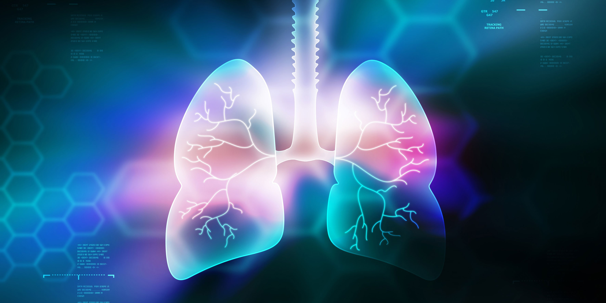

<a id="readme-top"></a>


<!-- PROJECT LOGO -->
<br />
<div align="center">
  <a href="https://github.com/othneildrew/Best-README-Template">
    
  </a>

  <h3 align="center">LUNG SOUND DETECTOR</h3>

  <p align="center">
    A ESW project to record, filter and classify lung sounds according to the condition.
    <br />
    <a href="https://github.com/AnuragPeddi16/lung-sound-detection.git"><strong>Explore the docs »</strong></a>
    <br />
    <br />
    <a href="https://github.com/AnuragPeddi16/lung-sound-detection/blob/main/demo_video.mp4">View Demo</a>
    ·
    <a href="#Usage">View Usage</a>
    .
    <a href="Contributors">Contact Us!</a>
  </p>
</div>


<!-- TABLE OF CONTENTS -->
<details>
  <summary>Table of Contents</summary>
  <ol>
    <li>
      <a href="#about-the-project">About The Project</a>
      <ul>
        <li><a href="#built-with">Built With</a></li>
      </ul>
    </li>
    <li>
      <a href="#getting-started">Getting Started</a>
      <ul>
        <li><a href="#prerequisites">Prerequisites</a></li>
        <li><a href="#installation">Installation</a></li>
      </ul>
    </li>
    <li><a href="#usage">Usage</a></li>
    <li><a href="#contributing">Contributing</a></li>
  </ol>
</details>


<!-- ABOUT THE PROJECT -->
## About The Project


In this project, we aim to present a comprehensive approach to lung sound detection and classification using various filtering and machine-learning techniques.For this, we tried multiple algorithms and models and finally settled on the few that we will presented here.

Introduction:
* Accurate detection and analysis of lung sounds are crucial in biomedical signal processing.
* This work focuses on developing a pipeline for real-time sound analysis involving noise filtering using a band-pass filter, wavelet decomposition, and spectral gating.​
* It further specifies models to neatly classify data based on the recording.

Use the <a href="#getting-started">Installation and Usage Process</a> to get started.

<p align="right">(<a href="#readme-top">back to top</a>)</p>


<!-- GETTING STARTED -->
## Getting Started

This is an example of on setting up your project locally.
To get a local copy up and running follow these simple example steps.

### Prerequisites

You must have git installed locally in the system.
Open terminal and type the following:
* git
  ```sh
  sudo apt-get install git
  ```

### Installation

_Below is an example of how you can install and set up the project._

1. Clone the repo
   ```sh
   git clone https://github.com/AnuragPeddi16/lung-sound-detection.git
   ```
2. Have Python3 installed
    ```sh
    sudo apt-get install python3
    ```
3. Make a virtual env and activate it
    ```sh
    cd lung-sound-detection
    python3 -m venv .venv
    source .venv/bin/activate
    ```
4. Install `requirements.txt` packages
   ```sh
   pip install -r requirements.txt
   ```
5. Run The SVM and CNN models
    ```sh
    cd SVM_Model
    python3 svm_train.py
    ```

<p align="right">(<a href="#readme-top">back to top</a>)</p>


<!-- USAGE EXAMPLES -->
## Usage

1. Turn on your Hotspot and put the SSID and Password in the code present at ```Recording/recording_web_server```.
2. Run the arduino code and keep the stethescope on the auscultation points.
3. After the webserver is hosted, run :
```sh
cd Filtering
python3 master_algo.py
```
4. The filtered audio will be saved in the Filtering folder as ```recording_filtered_output.wav```

5. Then host the website as:
```sh
cd website
python3 app.py
```
6. Open ```http://127.0.0.1:5000``` in your preferred web browser.
7. Choose your model and then drag and drop the ```recording_filtered_output.wav``` file into the box provided in the website.
8. It will give an output and the confidence score.
9. Enjoy! :)
<p align="right">(<a href="#readme-top">back to top</a>)</p>


<!-- CONTRIBUTING -->
## Contribution


### Contributors:<br><br>

Aryanil Panja (2023111005)<br>
Phone: 7776959216<br>
Email: aryanil.panja@research.iiit.ac.in<br><br>

Anurag Peddi (2023101090)<br>
Phone: 8374844201<br>
Email: anurag.peddi@students.iiit.ac.in<br><br>

Karthik Venkat Malavathula (2023111025)<br>
Phone: 9353153450<br>
Email: karthikvenkat.m@research.iiit.ac.in<br><br>

Adithya Addepalli Casichetty (2023101024)<br>
Phone: 9345831382<br>
Email: adithya.addepalli@students.iiit.ac.in<br><br>

<p align="right">(<a href="#readme-top">back to top</a>)</p>


